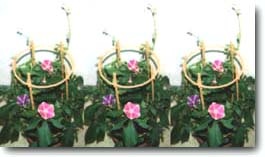

炎炎夏日正式登场了！每天都是酷暑难当的感觉呢。大家最近还好吗？

我去了一趟入谷的牵牛花市集【*在东京都台东区北部的入谷，有一个“朝颜市”，即牵牛花市集。不同于普通的市集，在这里卖家会把各种各样正在培育定型中的牵牛花摆到大街上，供人们欣赏和购买。同时市集附近的神社和商店街也会举办庙会等各种活动。牵牛花市集会在每年的七月上旬左右出现在日本各地，其中入谷的牵牛花市集规模最大】。在一家西餐老店吃了蛋包饭和牛肉可乐饼之类的食物后，就马上动身出发了！本来以为去的人会特别多，结果到站后，咦？车站里空荡荡的…不过，当我走出车站的台阶后就看到了，到处都是满满当当的游客。在大马路的一边，牵牛花市集和庙会正一起热火朝天地举办着。各个品种的牵牛花争奇斗艳，还有一个花盆里同时开着五种不同颜色的呢。我之前买的是那种最传统的普通牵牛花。现在它正在我家阳台上精神满满地酝酿着可爱的“夏日”风景。【*在日本人看来，牵牛花代表着初夏，是季节变化的象征性植物。因此人们喜欢养一盆牵牛花，通过它来体会夏寒变迁】

在这之后就是去看花火大会了！我的心情也终于跟着激动了一把。

六月中旬之后，我每天都忙得不亦乐乎。
这其间也接受了一个与林原惠美小姐一起的对谈采访。那天还有我们两个人的写真拍摄任务，很高兴能在摄影棚和化妆间跟林原小姐闲聊几句。这种时候的惠美酱带给人一种和蔼又悠闲的感觉。

这次对谈采访听说会被发表在《月刊Newtype（角川）》的10月号（9月9日发售）上。内容是讲述我至今为止的工作等等之类的超级——长的历史的。

紧接着就在当天深夜，接到了一条词曲创作的任务。是由我创作主题曲《サクラサク》的动画《纯情房东俏房客》中的一位登场人物乙姬睦美的角色歌。被告知实际创作时间有三天。这可真是…久违地在挑战我的瞬间爆发能力。在这期间我时而面对着钢琴，时而又来回踱步，两天过去了感觉曲子还像未凝固的蛋液一般，终于在第三天，有了半熟的感觉。

黎明时分，我一口气快速完工，然后火速把样曲发给了指挥和编曲。

演唱者是睦美的声优雪乃五月小姐。虽然这回是我们第一次见面，但通过她的声音，以及唱歌时我们简短的交流对接等等，都让我感到她是我特别喜欢的那类型人。所以之后我们的和声编排和合唱都进行得非常顺利。光宗先生【*光宗信吉，作曲家，本曲的编曲者】也对编曲很满意，一副心情大好的样子。这是一首在温馨中带有喜悦心情的曲子，之前对《サクラサク》有些无语的朋友们这回也可以放心欣赏哟（笑）。

这首歌名叫《なんてステキな》，被收录在《Love Hina 3部作Love Hina③~奈留・睦美・莎拉篇~》专辑中，预定于8月23日发售。

没错，也有超级久违的エレナー全员同台演出活动。七月第一个周六，是エレナー的成员之一K子酱的婚礼日，我们决定演出《星に願いを》【*即迪士尼音乐《When You Wish Upon a Star》的日文版】的混声三部合唱，为此进行了一整天的紧张排练。我们相互感叹唱和声的感觉可真棒，是玩得超级开心的一天。婚礼结束要回去的时候，新娘子把捧花送给了我。

——大家知道这代表着什么吗？朋友们已经担心（？！）我到送捧花的地步了，没记错的话，算上这一回，我总共都收到四束捧花了……这究竟是？！

总之还是恭喜K子酱了！还有通过邮件告诉我明年将要结婚的粉丝朋友们，也恭喜大家了~演唱会的时候请一定带着女朋友一起来哟。

这世上有幸福美满的爱情，反之也会有令人苦恼、无法解脱的爱恋。

人类是非常复杂的生物，我觉得不光是爱情，甚至任何事情都不存在绝对的套路或公式。在听到这类故事的时候我也会产生很多思考，得出的结论是，比起追求一个完美的结局而彷徨和苦恼，反而坦诚地面对自己的心声、珍惜自己当下的真实想法才是最重要的。

如果不向结局走过去看看就不会知道它到底长什么样，所以才要竭尽全力地坦诚面对和珍惜当下的路。来之不易需加倍珍惜的爱情也好，无法轻易公之于众的秘密之恋也罢，诚实地面对自己的内心，不论是值得高兴的事情还是令人难过的事情，若是能一视同仁地不对其刻意逃避，而是直面它们，最终便能迎来与之最相称的结局不是吗？我觉得这样就已经足够了。

话说回来，不管是那些发生之后才恍然大悟的事情，还是那些只有当时才蒙在鼓里想不明白的事情，发生其中任何一种都会使我们苦恼。我感觉自己就经常会有那种事后才大彻大悟的情况，但一想到现在眼前正在进行中的各种事情，正是抱着“希望能给某些人带去喜悦，同时自己也想从中获取快乐”的心情而持续着的，那么就重新振作起来，加倍珍惜地放手去做吧。——这就是我在七月的某个晴朗的早晨所感悟到的。

我想接下来有很多朋友都要进入暑假了。在这或长或短的休假里，你有什么计划吗？我的话，想去看看淡路的花卉博览会。刚好现在收音机里正在播放松任谷由实的《緑の町に舞い降りて》【*一首描写盛冈景象的歌曲】，所以也想去一趟盛冈。

再有就是，之前从别人那听说了一家不错的台湾料理店，我也想着一定得去尝尝看。

把“好好学习，好好玩耍”放在心底，请你也尽情享受这个愉快的夏天。

P．S.感谢大家在我没出现的这段稍微有点长的时间里也发来邮件。小小的愉快的事情、心情放松的事情、不经意的小事、令人暖心的关怀，全部这些邮件我都有看到。非常开心，再次谢谢大家。

------

6月某日（星期三）…去电影院看《火星任务》，正片前的广告里播出了“KAGOME六条麦茶”的CM广告，把我吓了一跳！不过我很开心。婴儿在荧幕上也显得特别巨大…【*律子曾为这款麦茶的电视广告做配音，广告中的主角是一个婴儿】
电影的结局令人目瞪口呆。坐在我旁边的一对情侣多半也是这么想的。

7月某日（星期二）…下午，去录音棚录制《なんてステキな》的合唱。录完后还需要等待磁道下移，我们就定于晚上九点再次集合。原本我想趁这个间隙回去休息一下，想不到突然下起了猛烈的雷阵雨。雨点从四面八方袭来，雷鸣响彻天际，窗户对面也闪过好几道闪电。有种被关在笼子里的感觉，既兴奋得心跳加快，又吓得发抖。

到了晚上天气已经平稳下来，像是什么都没发生过一样。

23：30，一边听着今天录制完成的曲子，一边开开心心地回了家。

7月某日（星期六）…我养的牵牛花长出来了，一口气冒了四个花骨朵。让我觉得有点小兴奋！

7月某日（星期日）…在东京国际爱乐厅开演的井上喜久子小姐的音乐会，大获成功！不过台下清一色都是男性观众，仿佛身处男子学校的体育馆一般，演出结束的时候我有点像是呼吸困难的感觉（…这是什么感觉？！），走路都有些晃晃悠悠。于是去大厅的出口打了个电话，稍微聊了几句平静下来后，回家。听说喜久子小姐在舞台上喝的饮料居然叫做“黑豆汤”，这是一种我既没喝过也没见过的饮料，下次有机会向她请教一下吧。

牵牛花有两朵绽开了。分别是紫色和红色的，一朵接着一朵。
7月某日（星期一）…四朵花开了。早晨和傍晚的浇水已经变成了我每天必做的愉快功课。

7月某日（星期二）…又有两朵花开了。花蔓也很快地长了起来。按这个进度长下去，我在这个夏天怕是能看到上百朵牵牛花了。会不会在某天早晨，我起床后拉开窗帘就能看到“希区柯克的‘牵牛花’”呢…？！【*希区柯克：著名悬疑电影大师】

---

毎日、夏本番！という暑さですね。お元気ですか。

入谷の朝顔市に行きました。老舗の洋食屋さんでそれぞれオムライスとビーフコロッケなど食べてから、いざ！　ものすごい混雑を予想して行ったら、あれれ？　駅はがらがら…。でも、階段を上がってみるといました、いました、人がいっぱい。大通りが一面、朝顔の市と縁日になっていて盛り上がっています。いろんな種類があって、ひとつの鉢で５色の花が咲きますなんてのもあるんだよ。私が買ったのは、昔ながらの普通の朝顔。今、ベランダで元気に可憐に"夏"の風情をかもし出してくれてます。

そして、これからは花火大会ね！　私の心もいよいよ燃えてきました。

６月なかばからは、めまぐるしい日々が続いています。

林原めぐみさんとの対談にも行ってきました。この日は２人での写真撮影もあり、撮られている間や、その前のメイク室でも少しおしゃべりできてよかった。こういう時のめぐちゃんは、穏やかでゆったりした雰囲気の人なのです。

記事は、月刊ニュータイプ（カドカワ）の１０月号（９月９日発売）に載るそうです。内容は、私のこれまでの仕事のことなど長―い歴史のはなし。

そしてその夜遅く、詞曲作りの指令が。私が主題歌「サクラサク」を作ったアニメ『ラブひな』の、登場人物のひとり"乙姫むつみ"のための歌です。正味３日間で、とのこと。これは…久々に試される瞬発力。ピアノに向かったりうろうろ歩いたり、２日間はまだまだ固まらないたまごみたいで、３日目にやっと半熟たまごが見えてきたかんじ。

明け方頃、一気にダーッと仕上がって、その後私のデモは速攻でディレクター氏～アレンジャー氏へと回っていったのでした。

歌は、むつみ役の雪乃五月さん。今回はじめてお会いしたけれど、声や、歌う時の言葉のちょっとした言いまわしなんかが、私にはかなり"好きなタイプ"の人でした。　なので、コーラスアレンジ＆

コーラスもとってもノッちゃった。 光宗さんもアレンジがすごくうまくいっちゃった、とご機嫌な様子。ほんわかとしたウキウキ感の曲ですから、｢サクラサク｣でちょっと"……。"な感想だった方も今度は大丈夫（フフフ）。安心して聴いて下さいね。

「なんてステキな」というこの曲は、８月２３日発売予定の『ラブひな』３部作(3)に収録されます。

そうそう、超久しぶりにエレナーの３人で歌う、なんて場面もありました。７月最初の土曜日、エレナーのひとり、K子ちゃんの結婚式があり、「星に願いを」を３部コーラスでやろうってことになりまして、１日みっちり練習もしたのです。ハモるとやっぱり気持ちいいねーなんて言い合って、楽しい日になりました。そして帰りには、お嫁さんのブーケをもらった私。

――――その意味を知っていますか？　友達はもはやみんな私を心配（？！）してくれてブーケをくれるものですから、これまでに確か、もう通算４個ももらっているはず。……これはいったい？！

ともかくK子ちゃん、おめでとう！　それから、メールで来年の結婚のご報告をくださった方、おめでとうございます。コンサートにはぜひ彼女といらしてね。

と、成就する恋もあれば、ちょっと悩みにはまってる恋もある。

人はとてもそれぞれだから、恋に限らず何事にも、一般論や法則のようなものはないと私は思っているのですけれど、話を聞いて思うことはあります。よい結末の為にどうしたらいいかってことよりも、なによりも心に素直に、"今"の心を大切に、ってことです。

結末は結末を迎えてみないとわからないから、今を大切に、素直に、ってことに尽きると思う。可愛い恋も秘密の恋も、誠実に"今"と向き合ってそこで楽しい事もつらい事もなげずにみつめていけば、おのずとその人に一番ふさわしい結末がやってくるのではないかしら。そうだといいな、と思ってます。

それにしても、あとになってわかる事・その時にしかわからない事、どっちもあって私たちは悩む。私にはあとになってわかる事がすごく多い気がするけれど、誰かを喜ばせたくて自分も喜びたくてしている今のいろんな事を、あらためて大切に思いながらやっていこう、と思った７月晴天の朝でした。

これから夏休み、という方も多いと思います。長い休み、短い休み、あなたも何か計画がありますか？　私は淡路の花博を見てみたい。ちょうど今流れてきたユーミンの「緑の町に舞い降りて」を聴いてると、盛岡にも。

それから、教えていただいた台湾料理のお店にもぜひ言ってみるつもりです。

"よく学びよく遊べ"を心の片すみに、あなたもどうぞ楽しい夏をね。

P.S.        少しごぶさたしていた間にも、メールをありがとうございました。ちょっと楽しい話、しんみりさん、なにげない事、やさしいお気づかいも全部、それはそれはうれしく読ませていただいてます。ありがとう。

---------------------------

６月○日（水）…『ミッション　トゥ　マーズ』を観に行くと、上映前の大画面に「カゴメ六条麦茶」のCMが流れて私はビックリ！　うれしくなる。赤ちゃんも巨大…。
映画の結末にはあっけにとられる。隣のカップルもどうやら同じ感想。

７月○日（火）…午後、スタジオで「なんてステキな」のコーラス録り。そのまま仕上げのトラックダウンに入るので、再びの集合は21：00。一度部屋へ戻りのんびりしていたら、ものすごい夕立があった。雨は上から下から横から、雷は鳴り響き、窓の向こうにはピカリと光る稲妻が何度も。閉じ込められた気分でワクワクしながら恐れおののく。
夜はもう何事もなかったように静かになっていて、23：30、仕上がった音を聴きながら楽しく帰宅。
７月○日（土）…朝顔が咲いてた、いきなり４つも。これはちょっと、スゴクウレシイ！

７月○日（日）…国際フォーラム・ホールCで井上喜久子さんのコンサート。大成功！でした。でも男の人一色の客席はまるで男子校の体育館みたいで、終わる頃には私は呼吸困難みたいな気持ち（…ってどんな気持ち？！）になって動揺してしまっていた。なのでホールを出た所で電話。ちょっとだけしゃべって気を落ちつかせてもらってから、帰る。
きっこさんのステージ上での飲み物は、なんと"黒豆の煮汁"だそうで、私はまだ飲んだことも見たこともないので、今度教えてもらおう。

朝顔は２つ咲く。紫と赤いのがひとつずつ。

７月○日（月）…４つ開花。朝夕の水やりが楽しい日課になってきました。

７月○日（火）…２つ開花。つるもぐんぐん伸びてる。このペースでいくと、私はこの夏１００個くらい朝顔の花を見れそう。ある朝、起きてカーテンを開けたら"ヒッチコックの「朝顔」"になってるか…？！
