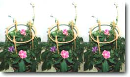

感觉暑假也差不多告一段落了呢。

到目前为止，我一共去看了两场烟花。一场是我徒步前往的家附近的花火大会，还有一场是朋友意外中奖得到了入场券，邀请我一起去看的“东京湾大华火祭”。非常幸运的是，这两场我都在高地欣赏到了烟花。这个夏天的气温和日晒都过于让人望而却步了，白天我干脆呆在家里不出门（这个安逸的做法有点逃避心理了…），所以旅行的计划也准备在这之后。花火大会也还有好几场可以看♡。

你的每一天又是怎样度过的呢？

我的心境总是在开心与寂寞之间来回往复。总觉得有某处还陷在泥潭里无法挣脱，但是，讲道理日子确实是在一天天地交替行进着的。比起展望遥远的未来，我现在更专注于非常近在眼前的事物。努力不让精神懈怠下去，今天也要加油。

然后带着希望的目光看向明天吧。

----

8月某日（星期三）…收到了7月21日发售的CD样盘。那是一张叫做《エルフ　アニメーションソング·ファイル》的专辑，里面有我作曲的两首歌《色づく頃に…》和《光りのリング》【*这两首歌分别是动画《同级生2》的OP和印象曲】。可能因为是挺久以前作的曲了，而且歌曲录制之类的环节我都没有参加，导致我都有点忘记这两首曲子了（…！），所以听的时候意外地感觉很怀念。

----------

そろそろ夏休みも一段落ムードですね。

花火は今のところ、２つ行きました。徒歩で出かけた近くの花火大会と、友達が“入場券が当たった！”と誘ってくれた東京湾大華火祭。どちらもアップで見れて感激でした。この夏はあまりの気温と日射しにおののいて、日中外に出るのをやめていたので（それで済むところがちょっとおそろしい…）、旅行のおたのしみもこれからです。花火大会もまだいくつかあるし♡。

あなたはどんな毎日でしたか？

私の心はうれしいとさびしいのくり返し。まだどこかぬけだせない感じは続いているけれど、日々、変化していくはず。遠い先の展望よりも、すごく“近い目”で過ごしている今。気持ちを萎えさせぬよう、今日も頑張ろう。

そして希望の目で明日を見よう。

------

８月○日（水）…7/21に発売されていたというＣＤのサンプル盤が届く。それはアルバム『エルフ　アニメーションソング・ファイル』で、私の作曲は「色づく頃に…」と「光りのリング」の２曲。ずっと前に作ったものだし、レコーディング等に立ちあわなかったせいもあってか、少し忘れかけていた（…！）ので、思いがけなく懐かしく聴く。

